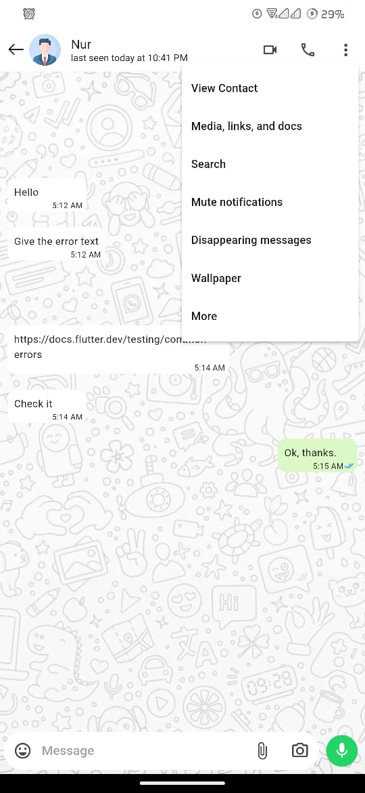
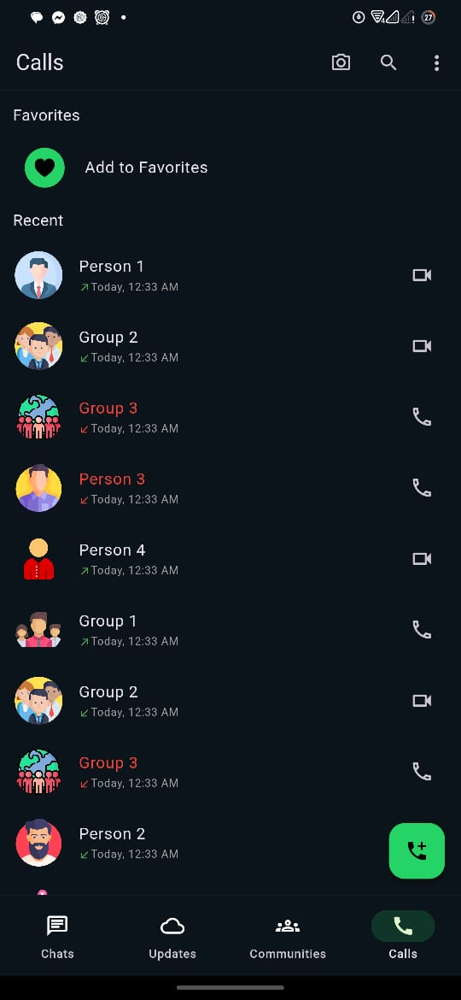
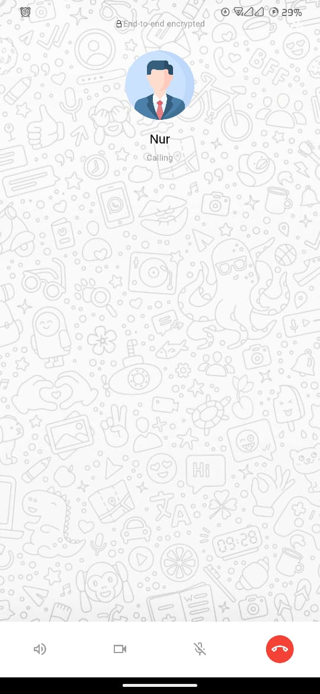

# WhatsApp Clone with Flutter

Welcome to the **WhatsApp Clone with Flutter** project! This project aims to replicate the UI of WhatsApp using Flutter. This README will guide you through the structure of the project and provide information on how to get started.

## Table of Contents

- [Project Overview](#project-overview)
- [Features](#features)
- [Installation](#installation)
- [Usage](#usage)
- [Screenshots](#screenshots)
- [Contributing](#contributing)
- [License](#license)

## Project Overview

**WhatsApp Clone with Flutter** is a UI replication of the popular messaging app WhatsApp. This project focuses on the visual aspects and does not include backend functionalities like messaging, calling, or data storage.

## Features

- **Dark Mode and Normal Mode**: Toggle between light and dark themes.
- **Authentication Screens**: Splash screen, welcome page, phone number verification, OTP verification.
- **Home Screen**: Chats, status updates, and call logs.
- **Profile and Settings**: User profile and settings pages.
- **Messaging Interface**: Chat UI with options for audio and video calls.
- **Archived Chats**: View archived chats and settings.

## Installation

To get started with the project, follow these steps:

1. **Clone the repository**:
    ```bash
    git clone https://github.com/your-repo/whatsapp_clone_with_flutter.git
    ```

2. **Navigate to the project directory**:
    ```bash
    cd whatsapp_clone_with_flutter
    ```

3. **Install dependencies**:
    ```bash
    flutter pub get
    ```

4. **Run the application**:
    ```bash
    flutter run
    ```

## Usage

Once the application is running, you can explore the different screens and UI components of the WhatsApp clone. Use the theme switcher to toggle between normal and dark modes.

## Screenshots

The following section showcases screenshots of the application in both normal and dark modes, displayed side by side for comparison.

| Normal Mode | Dark Mode |
|-------------|-----------|
|  |  |
|  |  |
|  |  |
|  |  |
|  |  |
|  |  |
|  |  |
|  |  |
|  |  |
|  |  |
|  |  |
|  |  |
|  |  |
|  |  |
|  |  |
|  |  |
|  |  |
|  |  |

## Contributing

We welcome contributions to improve **WhatsApp Clone with Flutter**! If you have suggestions for new features, feel free to open an issue or submit a pull request. Please ensure your code adheres to our coding standards and includes appropriate tests.

## License

This project is licensed under the MIT License. See the [LICENSE](LICENSE) file for more details.

---

Thank you for using **WhatsApp Clone with Flutter**! We hope you enjoy the application and find it useful. If you have any questions or need further assistance, please don't hesitate to contact us.
